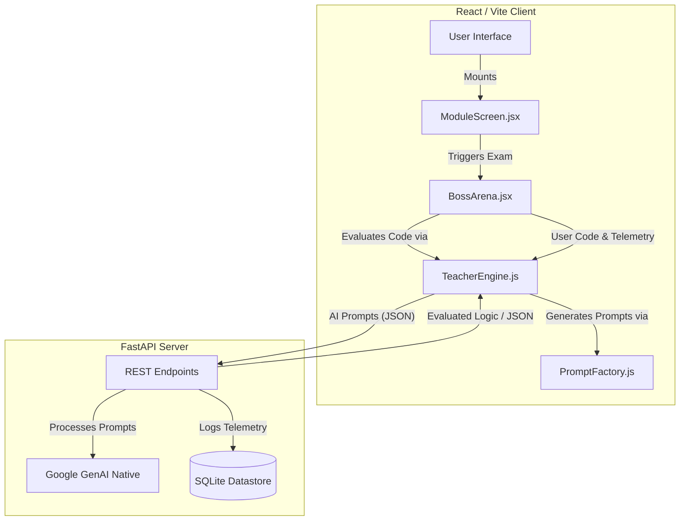

# NexGen: AI-Powered Interactive Learning Platform

NexGen is a cutting-edge, gamified educational platform built to teach Python through highly interactive, adaptive, and mentally engaging challenges. It completely reframes the traditional learning experience by replacing passive consumption with an *active, logic-driven Boss Arena*.

> 📖 **Looking for deeper technical details?** Check out the [Detailed Documentation](./DOCUMENTATION.md) for architecture, engine logic, and setup guides.

## 🌟 Uniqueness & Core Philosophy
Unlike standard code-learning platforms that test simple memorization, NexGen acts as an **Active Cognitive Profiler**:
- **The "Anti-Gravity" Exam Engine:** Boss battles (exams) are dynamically generated by AI not to test syntax, but to expose and punish predictable beginner assumptions, forcing deep comprehension.
- **Dynamic Duolingo-Style Queue:** When a user skips or fails a question in the Boss Arena, the active progress bar expands, and a duplicate of the missed question strategically cycles to the end of the exam queue.
- **AI Matchmaking & Psychiatrist Diagnostics:** The platform constantly monitors telemetry (time taken, tracebacks, retries). Upon failure, the AI "Diagnoser" runs a psychological profile, isolates the misconception, and the "Matchmaker" instantly injects a custom, targeted remedial question into the immediate next slot in the queue.
- **No Spoilers:** The "Explain Error" feature acts as a Socratic mentor. It refuses to give away exact solutions, instead generating analogous conceptual examples to preserve the integrity of the learning process.

---

## 🚀 Key Features

### 1. The Boss Arena (`BossArena.jsx`)
A high-stakes coding execution environment featuring:
- **Live Terminal Emulation:** Real-time Python formatting and console output directly in the browser via `react-simple-code-editor` and `PrismJS`.
- **Multi-Test Case Executions:** For "Creator Missions", user code is transparently evaluated against hidden backend test arrays.
- **Adaptive Progress Ring:** Visual indication of exact index history (Correct = Green, Skipped = Red, Active = Pulsing).

### 2. The Teacher Engine (`TeacherEngine.js`)
The intelligence hub orchestrating the application:
- **Tonal Personas:** AI Mentors shift from a friendly "Mentor", to a competitive "Rival", to a strict "System Architect" depending on the user's performance and "Hearts" (lives) remaining.
- **AI Grader:** Instead of fragile static regex, the AI evaluates the *logic* of the user's code, forgiving whitespace issues or typos (like `quak` instead of `quack`) as long as the underlying cognitive goal is met.

### 3. Curriculum Architecture
A meticulously modularized curriculum spanning 3 Phases:
- **Phase 1: Python Fundamentals** (Syntax, Variables, Control Flow, Conditionals)
- **Phase 2: Data Structures & Architecture** (Lists, Dictionaries, RegEx, File I/O)
- **Phase 3: Deep Logic & Data Science** (OOP, Decorators, Pandas, NumPy, Data Cleaning)

---

## 🛠 Tech Stack

### Frontend Architecture
- **Framework:** React 19 powered by Vite for lightning-fast HMR.
- **Styling:** Tailwind CSS v4 for utility-first, highly responsive design aesthetics.
- **Code Execution UI:** `react-simple-code-editor` combined with `PrismJS` for syntax highlighting.
- **Icons & Flourishes:** `lucide-react` for crisp SVG iconography, `canvas-confetti` for victory bursts.

### Backend Architecture
- **Framework:** Python / FastAPI for high-performance, asynchronous REST endpoints.
- **AI Core:** `google-genai` (Gemma Model) for all neural parsing, grading, and diagnostics.
- **Runtime Environment:** Uvicorn ASGI server.
- **Data Engineering Context:** Includes `pandas` and `numpy` natively to support execution of Phase 3 Data Science missions.

---

## 🗺 Architectural Diagram

---

## 📂 Project Structure

\`\`\`
nexgen(web)/
├── backend/
│   ├── main.py              # Main FastAPI application & Endpoints
│   ├── requirements.txt     # Python dependencies
│   └── nexgen.db            # Local Telemetry Datastore
│
├── frontend/
│   ├── src/
│   │   ├── components/      # Reusable UI Blocks (BossArena, Maps)
│   │   ├── data/            # Curriculum Modules (Phase 1, 2, 3)
│   │   ├── services/        # Logic Core (TeacherEngine, PromptFactory)
│   │   ├── utils/           # Editor hooks and parsers
│   │   ├── App.jsx          # Root React Component
│   │   └── index.css        # Tailwind Injections
│   ├── package.json         # Node dependencies
│   └── vite.config.js       # Vite build configuration
\`\`\`
